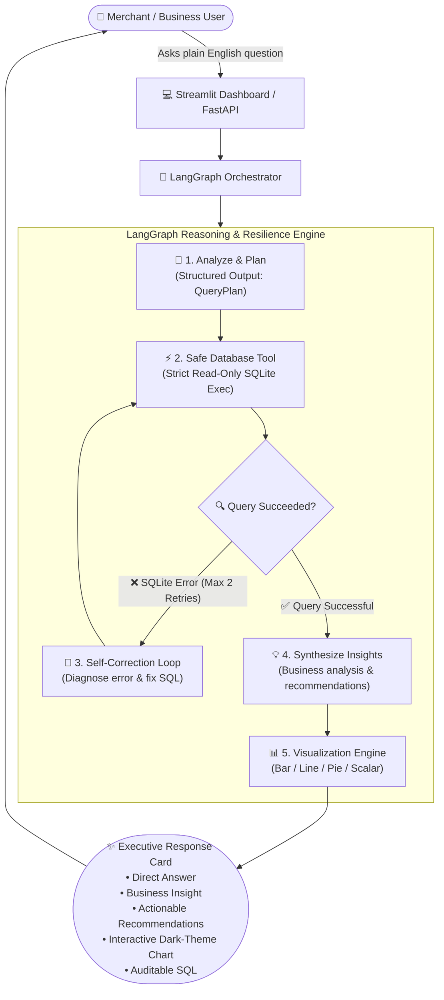
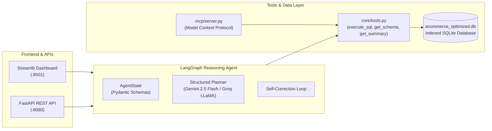

# 🛒 E-commerce AI Analytics — Autonomous Agentic Data Analyst

<div align="center">

[](https://ecommerce-data-agent.streamlit.app/)
[](https://www.python.org/)
[](https://groq.com/)
[](https://ai.meta.com/)
[](https://python.langchain.com/)
[](https://langchain-ai.github.io/langgraph/)
[](https://ai.google.dev/)
[](https://streamlit.io/)
[](https://modelcontextprotocol.io/)

<p align="center">
  <strong>Transform natural language business questions into validated SQL, self-healing queries, dark-mode charts, and actionable executive insights.</strong>
</p>

> 🌐 **Try the Live App in Your Browser**: **[https://ecommerce-data-agent.streamlit.app/](https://ecommerce-data-agent.streamlit.app/)**

</div>

---

## 📖 Executive Summary (What Problem Does This Solve?)

In modern e-commerce, business decision-makers (store owners, marketing heads, inventory managers) frequently need answers from their transactional and advertising data. Traditionally, they face two major bottlenecks:

1. **The SQL Bottleneck**: Non-technical team members must wait for data engineers to write custom database queries.
2. **Fragile AI Wrappers**: Simple LLM-to-SQL chains break the moment a column name is slightly off, a table doesn't match, or a syntax error occurs, leaving users with cryptic database tracebacks.

**E-commerce AI Analytics** solves this by operating as an **autonomous, self-healing AI Data Analyst**. Instead of just generating raw SQL, it reasons through the business question, plans a safe query, executes it, **automatically diagnoses and corrects errors if the query fails**, creates interactive charts, and synthesizes natural language business advice.

---

## 📊 Live System Flowchart



---

## ⚖️ Why Agentic Analytics vs. Traditional Text-to-SQL?

| Feature | Traditional Text-to-SQL | 🛒 E-commerce Agentic Analyst |
| :--- | :--- | :--- |
| **Workflow** | Rigid, one-shot linear pipeline (`Question → SQL → Error`) | **Dynamic LangGraph State Machine** with self-correction |
| **Error Handling** | Crashes on syntax/column errors with red tracebacks | **Self-healing retry loop**: diagnoses error and rewrites SQL |
| **Output Type** | Raw SQL strings or basic raw tables | **Executive cards**: direct answer + insight + tips + charts |
| **Visualization** | None, or requires manual user configuration | **Autonomous**: decides when a chart is needed and picks the right type |
| **Data Safety** | Can accidentally run destructive commands | **Strict sandbox**: blocks `DROP`, `DELETE`, `UPDATE`, `ALTER` |
| **Ecosystem** | Siloed inside one script | **Exposed over Model Context Protocol (MCP)** for any agent |

---

## 🖼️ What the User Sees (Visual Interface Walkthrough)

When you ask a question like *"Which products generated the highest revenue?"*, the system doesn't just print a table. It returns an executive-ready card:

```text
┌──────────────────────────────────────────────────────────────────────────────┐
│  💡 ANSWER                                                                   │
│  The top 3 products by revenue are: Product 21 ($168,856.46),                │
│  Product 27 ($132,119.10), and Product 15 ($114,890.63).                     │
├──────────────────────────────────────────────────────────────────────────────┤
│  📈 BUSINESS INSIGHT                                                         │
│  Revenue is heavily concentrated at the top. The top 4 items generated over  │
│  $100,000 each, indicating a classic power-law distribution where 1.5% of    │
│  the product catalog drives over 50% of total store sales.                   │
├──────────────────────────────────────────────────────────────────────────────┤
│  🎯 RECOMMENDATIONS                                                          │
│  Scale advertising budget on Product 21 and create bundle offers with        │
│  complimentary lower-tier accessories to increase Average Order Value (AOV). │
├──────────────────────────────────────────────────────────────────────────────┤
│  📊 AUTOMATED VISUALIZATION (Dark Mode)                                      │
│  ┌────────────────────────────────────────────────────────────────────────┐  │
│  │  $168k █                                                               │  │
│  │  $132k █ █                                                             │  │
│  │  $114k █ █ █                                                           │  │
│  │        Prod 21   Prod 27   Prod 15                                     │  │
│  └────────────────────────────────────────────────────────────────────────┘  │
├──────────────────────────────────────────────────────────────────────────────┤
│  ▼ 🔍 View Generated SQL Query (Click to Expand)                             │
│     SELECT item_id, total_lifetime_sales FROM products                      │
│     ORDER BY total_lifetime_sales DESC LIMIT 3;                              │
├──────────────────────────────────────────────────────────────────────────────┤
│  ▼ 🤖 View Agent Reasoning Steps (Click to Expand)                           │
│     [ANALYZE] Question: 'Which products generated the highest revenue?'      │
│     [PLAN] Rank products table by total_lifetime_sales descending            │
│     [EXEC] Query executed on SQLite (3 rows returned)                        │
│     [SYNTHESIZE] Synthesizing business insight from data...                  │
└──────────────────────────────────────────────────────────────────────────────┘
```

---

## 📈 Factual Dataset Metrics

The application operates on real, indexed e-commerce performance data:

- 📦 **270 Active Product SKUs**
- 💵 **$1,004,904.56 Total Tracked Revenue**
- 🛒 **9,473 Total Units Ordered**
- 📢 **$52,942.21 Advertising Spend Tracked**
- 🎯 **7.92x Blended Return on Ad Spend (ROAS)**
- 📊 **4,600+ Historical Daily Performance Records** (Sales, Clicks, Impressions, Conversions)

---

## 👥 Real-World Questions by Role

### 💼 For E-commerce Founders & Executives
- *"What is our total sales revenue and units ordered to date?"*
- *"Show the daily sales trend over the recorded period."*
- *"What is our overall advertising ROAS?"*

### 🎯 For Performance Marketers
- *"Which products have the highest Return on Ad Spend (ROAS)?"*
- *"Show products with the lowest Cost Per Click (CPC)."*
- *"Which products have the highest Click-Through Rate (CTR)?"*

### 📦 For Product & Inventory Managers
- *"Show me the top 10 products by total lifetime sales."*
- *"How many products in our catalog are currently eligible for ad campaigns?"*
- *"Which products have lifetime sales exceeding $50,000?"*

---

## 🏛️ System Architecture & Technology Stack



### Why We Chose These Technologies:
- **LangGraph**: Directed graph orchestration allows explicit error recovery edges and state tracking that linear chains cannot achieve.
- **Pydantic Structured Outputs**: Eliminates fragile regular expressions by guaranteeing machine-readable query plans and insights.
- **Google Gemini 2.5 Flash**: Fast inference, high SQL syntax precision, and native structured output support.
- **Model Context Protocol (MCP)**: An open standard enabling any MCP-compatible assistant (Cursor, Antigravity, Claude Desktop) to connect directly to our database tools.
- **Streamlit & Dark-Mode Matplotlib**: Provides an intuitive, responsive frontend that non-technical users can interact with immediately.

---

## 🚀 3-Minute Quickstart

### Prerequisites
- Python 3.10, 3.11, or 3.12
- Git

### 1. Clone the Repository
```bash
git clone https://github.com/katta-karthik/ai_agent_for_ecommerce-data.git
cd ai_agent_for_ecommerce-data
```

### 2. Set Up Virtual Environment & Dependencies
```bash
# Create and activate virtual environment
python -m venv .venv
source .venv/bin/activate       # macOS / Linux
# or
.venv\Scripts\activate          # Windows PowerShell

# Install dependencies
pip install -r requirements.txt
```

### 3. Add Your API Key
Copy the template file to `.env`:
```bash
cp .env.example .env
```
Open `.env` and add your **Google Gemini** or **Groq** API key:
```ini
GOOGLE_API_KEY=your_gemini_api_key_here
# or
GROQ_API_KEY=your_groq_api_key_here
```
*(Note: If no API key is provided, the application automatically uses smart built-in rule fallbacks so all demo queries still function!)*

### 4. Launch the Web Application
```bash
streamlit run app.py
```
Open your browser at **[http://localhost:8501](http://localhost:8501)**.

> 🌐 **Live Cloud Demo**: Don't want to run locally? Experience the deployed app at **[https://ecommerce-data-agent.streamlit.app/](https://ecommerce-data-agent.streamlit.app/)**

---

## 🔌 API & MCP Integrations

### 1. FastAPI REST Service
Launch the backend REST server:
```bash
python api.py
```
Send an analytical request:
```bash
curl -X POST http://localhost:8080/ask \
  -H "Content-Type: application/json" \
  -d '{"question": "What are my top 5 selling products?"}'
```

Interactive Swagger documentation is available at **[http://localhost:8080/docs](http://localhost:8080/docs)**.

### 2. Model Context Protocol (MCP) Server
To use these tools with MCP clients (Claude Code, Cursor, Antigravity):
```bash
python mcp/server.py
```
**Exposed Tools:**
- `execute_sql(query)`: Safe read-only SQLite execution tool.
- `get_schema()`: Complete table and column introspection.
- `get_sales_summary()`: Top-level business KPIs.

---

## 🛡️ Security, Guardrails & Protection

The platform implements multi-layer enterprise security to safeguard production data:

1. **AI Security Firewall (`meta-llama/llama-prompt-guard-2-86m`)**:
   - Every incoming question is pre-screened by Meta's dedicated 86M security classifier on Groq.
   - Detects and immediately blocks prompt injections, jailbreaks, and system prompt override attempts before any SQL planning occurs.
2. **Read-Only Database Sandbox**:
   - Enforces strict statement verification via AST and regex inspection.
   - ✅ **Permitted**: `SELECT`, `WITH` (Common Table Expressions).
   - ❌ **Strictly Blocked**: `DROP`, `DELETE`, `INSERT`, `UPDATE`, `ALTER`, `TRUNCATE`, `CREATE`, `ATTACH`, `DETACH`, `PRAGMA`.
   - Multiple semicolon-delimited SQL injection attempts are actively rejected.
3. **Server-Side IP Rate Limiting & Daily Circuit Breaker**:
   - Protects against shared token exhaustion by tracking client IP addresses across refreshes (`MAX_QUERIES_PER_IP_PER_DAY = 3`).
   - Global container circuit breaker (`MAX_GLOBAL_DAILY_QUERIES = 200`) ensures the demo host key remains safe 365 days a year.
   - Optional custom API key bypass for recruiters and users who want to run unlimited queries.

---

## 🤝 Contributing & License

Contributions, issues, and feature requests are welcome! Feel free to check the [issues page](https://github.com/katta-karthik/ai_agent_for_ecommerce-data/issues).

Distributed under the **MIT License**. See `LICENSE` for more information.
